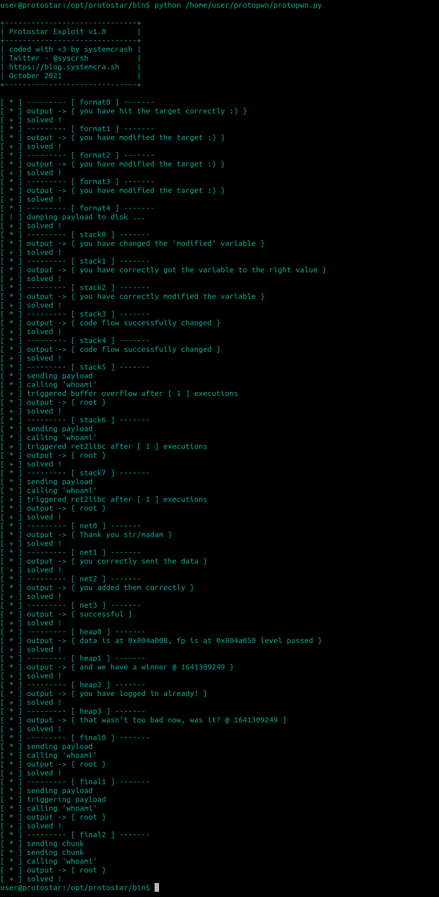

# protopwn

This is collection of exploit scripts that solve the well-known Protostar exploitation challenges.
The challenges itself are quite old and the VM itself does not use any mitigations like ASLR or NX.
Despite that, the later levels can be quite challenging for someone inexperienced, so I would suggest you read the recommended papers _before_ each challenge.
Trust me, I certainly had my bang-head-against-keyboard moments with this one.

There are also countless writeups and walkthroughs already out there (like the excellent series from @LiveOverflow), so I won't bother with yet another one.

**Usage**

1. Setup the VM so you can `ssh` into it.

2. Just copy the protopwn folder into the VM

    * `scp -r protopwn user@<Protostar IP>`

3. Change into the challenge directory

    * `cd /opt/protostar/bin`

4. Start the Exploit Script

    * `python /home/user/protopwn/protopwn.py`

**Bugs**

* There is a high likelyhood that atleast some of the solutions won't work for you as-is.
  This is due to stack-based exploits being extremely finicky to get right and reliable for every machine configuration, atleast 
  when used in simple ways like here. So expect to do some tweaking if you want this to work.

* In the `format4` level, I have no idea why it won't work when calling the binary from python with `Popen` (See source for details).

  The payload itself works, if you have any idea why the python code won't, I would love to know :)
  
* Also the Code is far from polished and is quite ugly at times. So be warned.

**Screenshot** 

